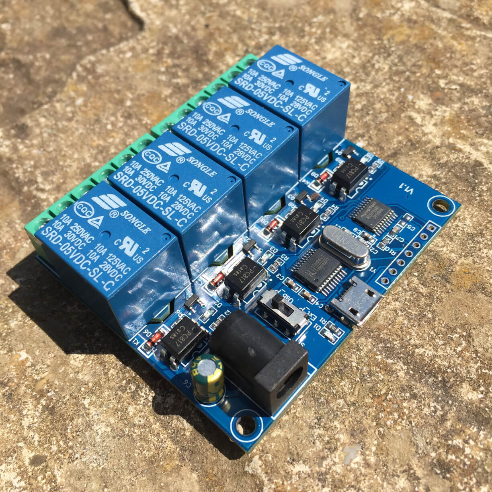

# Controlling a USB to serial port relay board with Python

This repository contains some example code for controlling
an LCUS USB to serial port relay board.

The code was developed and tested using an LCUS-4 board, possibly manufactured by 'EC Buying'.
It should also work with other similar boards including the LCUS-1, LCUS-2 and LCUS-8.

The example script is free to use and adapt as you wish.
For guidance to get started, please see the inline comments towards the
end of the script in the `if __name__ == '__main__'` block.
