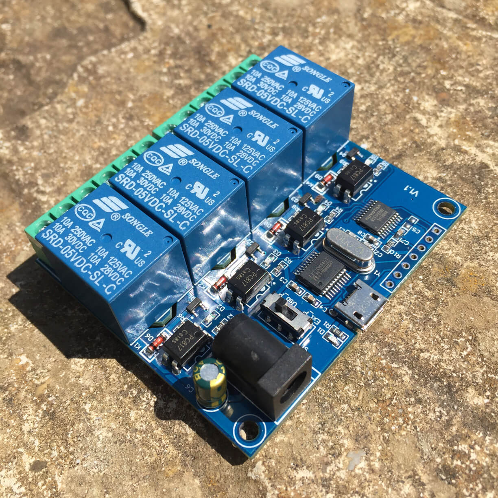

# Controlling a USB to serial port relay board with Python

This repository contains a module and example code for controlling an LCUS 
USB to serial port relay board with Python.

The module has been tested against a couple of devices: a four channel board 
from 'EC Buying', and a two channel board from 'SAMIROB / SAMIMORE ROBOT'.
Other modules such as LCUS-1, LCUS-2, LCUS-4, and LCUS-8 should also work.

*If a device you're using isn't listed, feel welcome to message me about it*.




## Installation / uninstallation

This module can be installed by downloading the project from GitHub.
Open a command prompt, navigate to the folder containing setup.py,
and type `pip install .` and then press enter.

To verify the module has been installed type `pip show lcus-usb-relay-module-controller`

To unintall the module type `pip uninstall lcus-usb-relay-module-controller`


# Getting Started
An example script is provided to get you quickly up and running, but there are
just a couple of minor changes you may need to make in order to configure it 
for your device.

1. The COM port setting on line 7 may need updating to match the one in use.

2. If using a SAMIROB device you'll need to update the import statement
to use DeviceB, e.g.

``` py
from lcus_usb_relay_module_controller import DeviceB as Device
```

(*By default the script uses DeviceA, which is intended to support 'EC Buying' devices*).


example.py:
``` py
import serial  # import serial from the pyserial package
from lcus_usb_relay_module_controller import Device

try:
	# Create and open a serial port...
	port = serial.Serial(
		port='COM4',		# Which port is yours on? Update as needed.
		baudrate=9600,
		bytesize=8,
		timeout=0.2,
		stopbits=serial.STOPBITS_ONE,
		parity=serial.PARITY_NONE,
	)

	# Create an instance of Device and associate it with the port...
	device = Device(port)

	# Open the first relay...
	device.open(0)

	# Check the status of the first relay...
	if device.check(0) == 1:
		print('The first relay is open.')

	# Alternatively we can set and get relay states using the indexer...
	device[1] = 1		# Open the second relay (same as device.open(1))
	if device[1] == 1:  # Check if the relay is open (same as device.check(1))
		print('The second relay is open.')

	# Query the status of all relays...
	relay_status = device.query_status()
	print(relay_status)  # [1, 1, 0, 0]

	# Close all relays...
	for ch in range(0, device.relay_count):
		device.close(ch)

except Exception as err:
	print('repr', repr(err))

finally:
	if(port.is_open == True):
		port.close()
```

## Troubleshooting
This module has a dependency on the serial module from pyserial, which should
have installed automatically. Before submitting a support request please verify
the version info of pyserial installed on your system using the command
`pip show pyserial`.  Note there's another package available on pypi.org named
'serial' that is incompatible. Make sure you are importing the correct module.

## Changelog

0.2.0 open_all, close_all, and invert_all functions added

0.1.0 **Bug fix**:
   Initialising Device objects with SAMIROB devices failed because the 
   status information returned was in an unexpected format.

   **Enhancements**:
   Methods added to improve how relays are controlled and queried.
   The indexers for getting and setting relay states have been retained
   but they've always lacked the ability to verify whether an action
   succeeded or not.  For backward compatibility, the query_relay_status 
   method is also retained, but will not be available for other devices.
   Please use the query_status method instead.

0.0.2 Installation packaged created

0.0.1 Initial release
